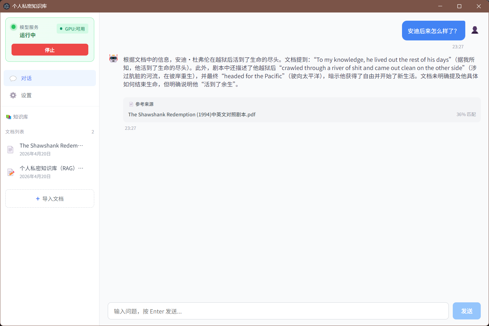
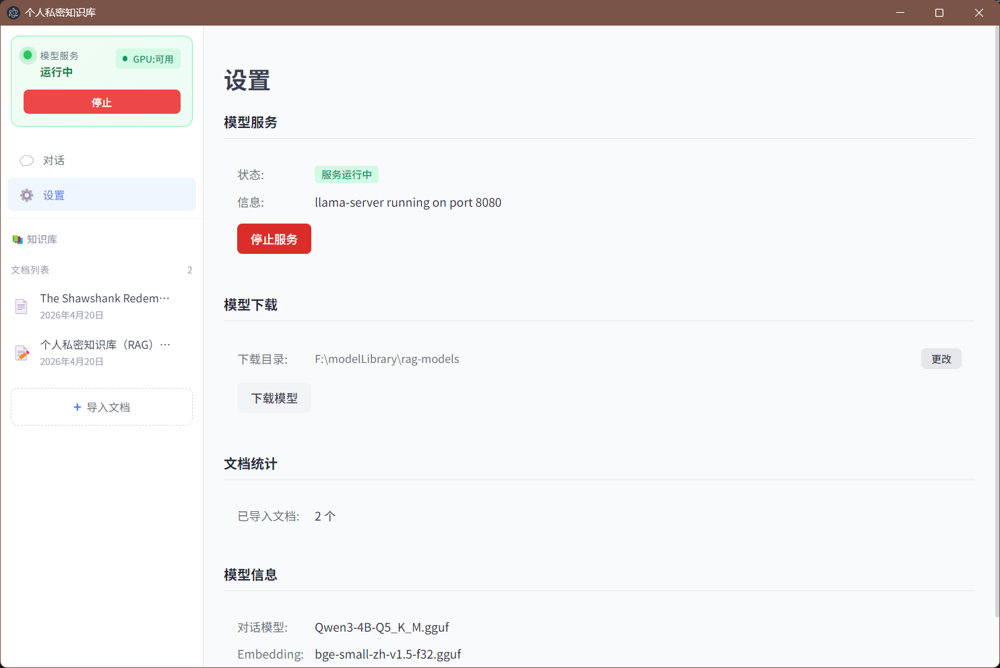

# PrivRAG - 私人文档向量知识库

<div align="center">


**🔒 纯本地运行的私人知识库 | 📄 支持 PDF/Word/Markdown/TXT | 💬 与文档对话**

*不上传、不外传 — 你的数据，只在你的电脑上。*

</div>

---

## 功能特性

### 核心能力
- 📄 **多格式支持** — PDF、Word、Markdown、TXT 文档导入
- 💬 **智能问答** — 基于向量检索的 RAG 对话，附带参考来源
- 🔒 **完全本地** — 所有处理在本地完成，无需联网
- ⚡ **一键启动** — 无需复杂配置，自带模型管理
- 🎨 **优雅界面** — Electron + Vue 3 打造的原生桌面体验
- 🖥️ **流式输出** —打字机效果，即时响应
- 📊 **引用溯源** — 回答附带文档出处，方便核实

### 技术亮点
- **RAG 检索增强生成** — 召回 + 生成双阶段
- **向量数据库 LanceDB** — 轻量、单文件、无依赖
- **LLM llama.cpp** — Qwen3-4B GGUF 量化模型
- **Embedding 向量化** — bge-small-zh-v1.5 中文本地模型
- **GPU 加速** — 自动检测 NVIDIA CUDA，支持 GPU 推理（如无GPU则使用CPU）

---

## 界面预览



---

## 快速开始

### 下载安装包（推荐）

前往 [Releases](https://github.com/SpanManX/private-RAG/releases) 下载最新版本：

### 从源码运行

```bash
# 克隆项目
git clone https://github.com/SpanManX/private-RAG.git
cd private-RAG

# 安装依赖
npm install

# 开发模式
npm run dev

# 构建 Windows 安装包
npm run build:win
```

### 环境要求

| 项目 | 最低要求 | 推荐配置 |
|------|---------|---------|
| 操作系统 | Windows 10 (64位) | Windows 11 |
| 内存 | 4 GB | 8 GB+ |
| 显存 | - | 4 GB+ (GPU 推理) |
| 磁盘 | 5 GB 可用空间 | 10 GB+ |

---

## 工作原理

```
┌─────────────────────────────────────────────────────────────┐
│                        文档导入流程                          │
└─────────────────────────────────────────────────────────────┘

  📄 PDF/DOCX/MD/TXT
         │
         ▼
  ┌──────────────────┐
  │  文档解析         │  提取纯文本内容
  │  DocumentProcessor │
  └────────┬─────────┘
           │
           ▼
  ┌──────────────────┐
  │  文本分块         │  512 字符/chunk
  │  Chunking        │
  └────────┬─────────┘
           │
           ▼
  ┌──────────────────┐
  │  Embedding 向量化  │  bge-small-zh-v1.5 (384维)
  │  本地 llama-server │
  └────────┬─────────┘
           │
           ▼
  ┌──────────────────┐
  │  LanceDB 存储     │  向量数据库
  └──────────────────┘

┌─────────────────────────────────────────────────────────────┐
│                        查询流程                              │
└─────────────────────────────────────────────────────────────┘

  用户提问："这篇文章讲了什么？"
         │
         ▼
  ┌──────────────────┐
  │  问题向量化       │  bge-small-zh-v1.5
  └────────┬─────────┘
           │
           ▼
  ┌──────────────────┐
  │  向量相似度检索   │  Top-K 最相关 chunk
  │  LanceDB IVF_PQ  │
  └────────┬─────────┘
           │
           ▼
  ┌──────────────────┐
  │  LLM 生成回答     │  Qwen3-4B GGUF
  │  拼接上下文       │
  └────────┬─────────┘
           │
           ▼
      💬 回答 + 📄 引用来源
```

---

## 技术栈

| 层级 | 技术 | 说明 |
|------|------|------|
| 桌面框架 | Electron 33 | 跨平台桌面应用 |
| 前端框架 | Vue 3 + TypeScript | 组合式 API |
| 构建工具 | electron-vite | 高速开发体验 |
| 状态管理 | Pinia | 轻量响应式 |
| LLM 推理 | llama.cpp (llama-server) | Qwen3-4B-Q5_K_M |
| Embedding | bge-small-zh-v1.5-gguf | 384 维向量 |
| 向量数据库 | LanceDB | 单文件、嵌入型 |
| 文档解析 | pdf-parse / mammoth | PDF/Word 支持 |

---

## 项目结构

```
├── resources/                      # 打包资源（dev 模式下在项目根目录）
│   ├── llama-server/               # llama-server 可执行文件
│   └── bge-small-zh-v1.5-gguf/     # Embedding 模型目录
│
src/
├── main/                           # Electron 主进程
│   ├── index.ts                    # 入口、窗口创建、IPC 注册
│   ├── serverManager.ts            # 对话服务管理器 (llama-server 8080)
│   ├── embeddingServerManager.ts   # 向量服务管理器 (llama-server 8081)
│   ├── documentProcessor.ts         # 文档解析 (PDF/DOCX/MD/TXT)
│   ├── indexManager.ts             # LanceDB 索引管理
│   ├── ragEngine.ts                # RAG 编排引擎
│   ├── logger.ts                   # 日志工具
│   ├── store.ts                    # electron-store 持久化配置
│   ├── langchain/
│   │   └── embeddings.ts           # LangChain Embeddings 封装
│   └── utils/
│       ├── llamaServerUtils.ts     # llama-server 路径查找
│       ├── nvidiaUtil.ts           # CUDA/GPU 检测
│       └── serverUtils.ts         # 服务工具 (waitForServer)
├── preload/
│   └── index.ts                    # 上下文桥接 (contextBridge)
└── renderer/                       # Vue 3 前端
    └── src/
        ├── main.ts                 # 前端入口
        ├── App.vue                 # 根组件
        ├── router.ts               # Vue Router 路由
        ├── components/
        │   ├── Sidebar.vue         # 侧边栏 (服务状态卡片)
        │   ├── ChatArea.vue         # 聊天区域
        │   ├── MessageBubble.vue    # 消息气泡
        │   ├── DocList.vue          # 文档列表
        │   ├── FileUploader.vue     # 文件上传
        │   └── GlobalError.vue      # 全局错误提示
        ├── views/
        │   ├── ChatView.vue         # 对话页面
        │   └── SettingsView.vue     # 设置页面
        └── stores/
            ├── chatStore.ts        # 聊天状态 (SSE 流式请求)
            ├── documentStore.ts    # 文档状态
            └── globalErrorStore.ts # 全局错误提示
```

---

## 配置说明

模型文件默认存放在 `%USERPROFILE%\Documents\rag-models` 目录，首次启动会自动提示下载 **（不可使用中文目录）**。

如需手动配置模型路径，可在设置页面修改。

---

## 日志文件

日志文件位于用户数据目录下：

| 环境       | 日志路径 |
|----------|---------|
| Windows  | `%APPDATA%\PrivRAG\logs\main.log` |

打开日志目录：
- Windows: 资源管理器地址栏输入 `%APPDATA%\PrivRAG\logs`

---

## License

MIT License - 永久免费，可自由使用、修改、分发。

---

<div align="center">

*如果对你有帮助，欢迎 ⭐ Star*

</div>
